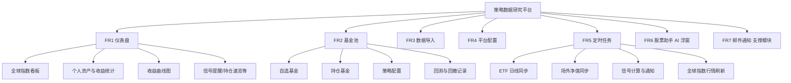
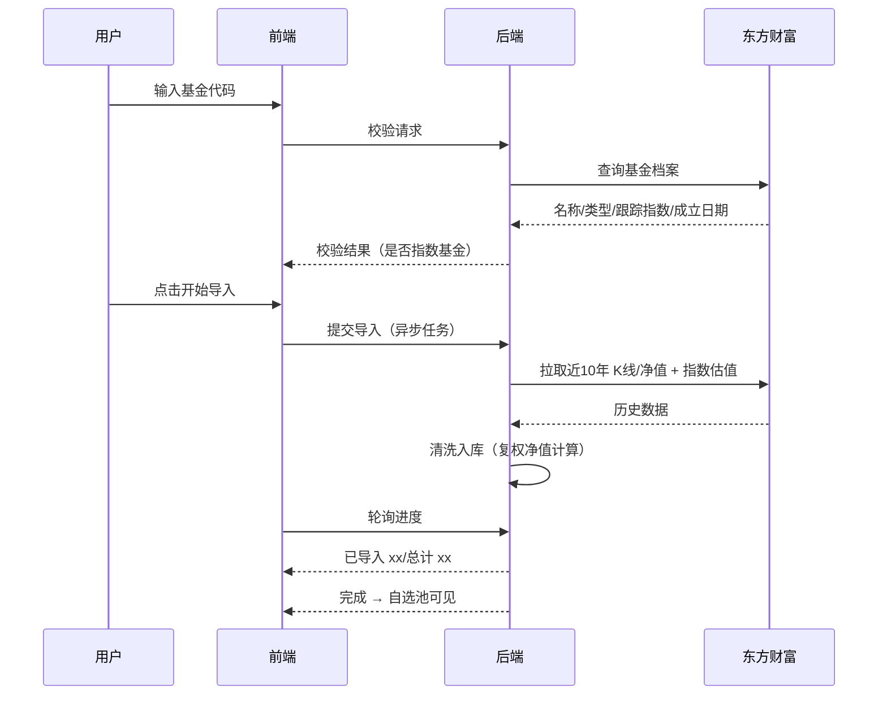
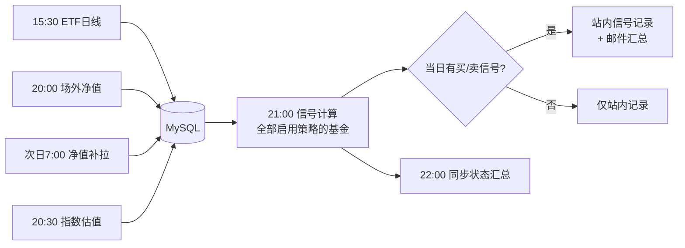
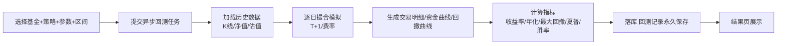

# 策略数据研究平台 · 技术需求文档

| 项目 | 内容 |
| --- | --- |
| 文档版本 | V1.1 |
| 编写日期 | 2026-09-15 |
| 文档状态 | 需求讨论稿（已含三轮需求确认结论） |
| 平台名称 | 待定（文中统称"本平台"） |
| 读者 | 产品/需求相关人、开发人员 |

> **V1.1 修订**：① SMTP 配置改为配置文件维护，平台配置仅保留只读卡片+测试按钮（FR4/FR7）；② 基金详情页新增估值区：按跟踪指数关联展示 PE/PB 曲线与百分位（FR2）；③ 明确股票扩展暂不预留。

> 本文档中所有标注 **【已确认】** 的条目均来自与需求方的正式确认，变更需重新评审；未标注的补充建议条目标注 **【补充建议】**，供需求方审阅取舍。

---

## 1. 项目概述

### 1.1 项目背景与目标

个人投资者在指数基金投资过程中，面临数据分散、策略难以验证、持仓收益统计繁琐等问题。本平台目标是构建一套**自用的量化投资辅助系统**：

- 汇聚 A 股及全球主要指数行情与个人资产数据，一屏总览；
- 管理指数基金自选池与持仓，自动同步行情/净值数据；
- 支持对单只基金配置个性化策略、执行历史回测并沉淀回撤数据；
- 基于策略每日产生**买入/卖出建议**，通过站内与邮件触达；
- 提供限定了话题范围的 AI 股票助手，可结合本平台数据回答投资问题。

### 1.2 系统定位与边界【已确认】

**本平台只做建议，不做交易。** 严格边界如下：

| 类别 | 内容 |
| --- | --- |
| ✅ 做 | 指数基金（场内 ETF + 场外指数基金）的数据管理、策略回测、买卖建议、收益统计、AI 咨询 |
| ❌ 不做 | 自动化交易、实盘下单、撤单、代理资金操作（不对接任何券商交易接口） |
| ❌ 不做 | 股票、债券、期货、外汇、加密货币等非指数基金标的 |
| ❌ 不做 | 对外提供服务（个人单用户自用，无注册入口，不对外开放） |

### 1.3 已确认的关键决策【已确认】

| # | 决策项 | 结论 |
| --- | --- | --- |
| 1 | 基金范围 | 场内 ETF 与场外指数基金**同时支持** |
| 2 | 数据源 | 东方财富公开接口（免费、免注册） |
| 3 | 用户体系 | 个人单用户简化版（仅管理员一个账号，保留登录/改密，无注册功能） |
| 4 | AI 大模型 | 智谱 GLM |
| 5 | 首期策略 | 网格交易、估值百分位（策略框架插件化，便于后续扩展） |
| 6 | 建议触达 | 站内展示 + 邮件通知 |
| 7 | 持仓录入 | 交易流水模式（手动录入每笔买卖/分红，系统自动汇总） |
| 8 | 部署形态 | 前后端不分离：Vue3 打包为静态资源嵌入 SpringBoot，单容器部署 |

### 1.4 目标用户

平台所有者本人（单一管理员）。使用者具备基本的基金投资知识，需要的是数据聚合、策略验证与建议提醒，而非面向公众的产品化服务。

---

## 2. 术语表

| 术语 | 解释 |
| --- | --- |
| 场内 ETF | 在交易所挂牌交易的指数基金（如 510300 沪深300ETF），有实时行情、开高低收、成交量，像股票一样按市价买卖 |
| 场外指数基金 | 按净值申赎的指数基金（如 110003），每日一个净值，无盘中成交价，有盘中实时估值（估算值） |
| 前复权 | 以当前价格为基准、向前调整历史价格的复权方式，用于消除分红除权造成的价格跳空，使技术指标与回测连续可比。本平台中 ETF 使用前复权价格 |
| 单位净值 | 场外基金每份的净资产价值，每日公布一次 |
| 累计净值 | 单位净值 + 历史每次分红之和，反映成立以来的累计收益（未考虑分红再投资的复利） |
| 复权净值 | 将分红再投资进行复利调整后计算的净值，用于场外基金的连续收益计算（作用等价于 ETF 的前复权价） |
| 盘中估值 | 场外基金交易日内根据持仓股实时行情估算的净值，仅供参考，非最终净值 |
| 估值百分位 | 某指数当前 PE/PB 在其历史区间（如近10年）中所处的百分位。百分位越低表示越便宜 |
| 网格交易 | 在设定价格区间内划分若干格子，价格每下跌一格买入一份、每上涨一格卖出一份的震荡市策略 |
| 定投 | 定期定额买入基金的策略（首期不实现，预留扩展） |
| 最大回撤 | 某段时间内资产从峰值回落到谷底的最大幅度，衡量策略最糟糕的亏损体验 |
| T+1 | A 股交易制度：当日买入的份额，次一交易日方可卖出/赎回 |
| 信号 / 建议 | 策略根据最新数据计算出的操作提示（买入/卖出/持有），仅提示，不执行 |

---

## 3. 总体功能结构

---

## 4. 功能需求

> 每个功能项包含：功能描述、页面与交互、业务规则、验收标准。

### FR1 仪表盘

#### 1.1 功能描述

登录后默认进入的首页看板，一屏总览"市场怎么样 + 我的资产怎么样 + 今天有什么建议"。

#### 1.2 页面与交互

页面自上而下分为四个区域：

**区域一：全球指数看板**

展示以下指数的最新点位、涨跌额、涨跌幅、迷你走势图（sparkline，近30个交易日）：

| 区域 | 指数 |
| --- | --- |
| A 股 | 上证指数、深证成指、创业板指、科创50、沪深300 |
| 港股 | 恒生指数、恒生科技指数 |
| 美股 | 道琼斯工业指数、纳斯达克综合指数、标普500 |
| 亚太 | 日经225 |
| 欧洲 | 德国DAX、英国富时100、法国CAC40 |

- 按区域分组展示，卡片式布局；涨跌用红/绿配色（A 股习惯：红涨绿跌）。
- 数据自动刷新：交易时段内每 5 分钟自动刷新一次，同时提供手动刷新按钮。

**区域二：个人资产概览卡片**

- 个人总资产（当前持仓市值 + 累计已落袋资金口径，见业务规则）；
- 当前总收益：金额 + 收益率（含已实现与浮动两部分，分开展示）；
- 本月收益、本年度收益（金额 + 百分比）。

**区域三：收益曲线图**

- 主线：个人累计收益率曲线；
- 副线【补充建议】：沪深300 基准对比线，直观看出跑赢/跑输大盘；
- 时间维度切换：近1月 / 近3月 / 近6月 / 今年 / 近1年 / 全部。

**区域四：提醒与速览区（本区域为【补充建议】内容，供确认）**

| 模块 | 说明 |
| --- | --- |
| 今日买卖建议 | 今日策略信号列表（基金、方向、理由），未读红点提示，点击跳转详情 |
| 数据同步状态 | 各基金最后同步时间、今晚定时任务是否成功，异常标红可一键重试 |
| 当前持仓速览 | 持仓基金卡片：名称、市值、今日盈亏、浮动盈亏 |
| 近7日收益概览 | 近7个交易日每日收益的柱状小图 |
| 自选基金涨跌榜 | 自选池今日涨跌幅排行（前5涨/前5跌） |
| 资产配置饼图 | 持仓按基金市值分布的饼图 |

#### 1.3 业务规则

1. 收益统计以**交易流水**为唯一事实来源：已实现收益 = 卖出/赎回成交金额 − 对应买入成本 − 手续费；浮动收益 =（最新价/净值 − 持仓成本价）× 持有份额；
2. 总资产口径 = 当前持仓市值（按最新价/净值估值）+ 累计已落袋资金净额；
3. 本月/本年度收益按自然月/自然年统计，基准为上月末/上年末总资产与期间流水综合计算；
4. 收益曲线按日频（交易日）绘制，历史收益根据当日价格/净值与持仓快照回放计算；
5. 场外基金估值时段使用盘中估值，净值公布后自动切换为正式净值。

#### 1.4 验收标准

- [ ] 14 个全球指数全部正确展示，涨跌幅与东方财富官网一致；
- [ ] 指数卡片迷你走势图正常渲染， hover 显示日期与点位；
- [ ] 总资产、当前总收益、本月收益、本年度收益与手工核算结果一致（以样例流水验证）；
- [ ] 收益曲线 6 个时间维度切换正常，基准对比线可开关；
- [ ] 今日建议、同步状态、持仓速览、近7日收益、涨跌榜、配置饼图均正常显示；
- [ ] 交易时段内行情每 5 分钟自动刷新。

---

### FR2 基金池

#### 2.1 功能描述

基金池是平台核心数据资产，分为**自选基金**与**持仓基金**两个视图。每个基金支持手动增量同步数据、配置个性化策略、发起回测并沉淀回撤记录。

#### 2.2 页面与交互

**Tab 页一：自选基金**

列表字段：基金代码、名称、类型标签（ETF / 场外）、最新价（ETF 为前复权收盘价）/ 最新净值（场外，附盘中估值）、当日涨跌幅、估值百分位（若跟踪指数已同步估值数据）、已配置策略图标、最后同步时间、操作列。

操作列：`同步`（手动增量同步，异步执行，行内显示进行中状态）、`详情`（跳转基金详情页）、`策略`（配置/管理策略）、`删除`（二次确认，仅删除自选关系，不删历史数据）。

列表上方：搜索框（代码/名称模糊过滤）、`导入基金` 按钮（跳转 FR3）。

**Tab 页二：持仓基金**

列表字段：基金代码、名称、持有份额、持仓成本价、现价/净值、持仓市值、当日盈亏、浮动盈亏（金额 + 百分比）、已实现盈亏、操作列（`录流水`、`详情`）。

- 持仓列表由交易流水自动汇总生成，**不提供直接编辑份额/成本的入口**（保证数据可追溯，见业务规则 4）。

**基金详情页**（点击任一基金进入）：

- 基本信息区：名称、代码、类型、跟踪指数、成立日期、基金公司；
- 行情图区：ETF 展示前复权日 K 线（ECharts candlestick，区间切换），场外展示净值走势（单位/累计/复权净值切换）；
- 估值区【已确认，按指数关联展示】：展示该基金的 PE/PB 历史曲线与当前估值百分位（低估/合理/高估区间着色）；数据经"基金 → 跟踪指数"关联取得，同一指数下多只基金共享同一份估值数据（不重复存储）；未识别跟踪指数的基金，该区块提示不可用；
- 交易流水区：该基金全部流水记录（新增/编辑/删除）；
- 策略配置区：已配置策略列表 + 新增策略（策略类型、参数表单、启停开关）；
- 回测区：历史回测记录列表（时间、策略、区间、总收益、最大回撤）+ `发起回测` 按钮。

**回测结果页**：

- 指标卡片：总收益率、年化收益率、**最大回撤**、回撤区间（起止日期）、夏普比率、交易次数、胜率；
- 资金曲线图（策略 vs 基准买入持有对比）；
- **回撤曲线图**（沿时间轴的回撤幅度分布）；
- 交易明细表：日期、方向、价格、份额、金额、手续费、信号理由；
- 回测记录永久保存，可随时回看。

#### 2.3 业务规则

1. 自选基金与持仓基金的关系：导入成功的基金自动进入自选池；产生买入流水后自动出现在持仓视图；卖出清仓后仍保留在自选池、从持仓视图消失；
2. 手动同步 = 增量补齐：从该基金最后同步日期拉取至今的数据，已存在且未变化的跳过，存在且变化的更新，不存在的插入；ETF 在盘中同步时，当日 K 线为实时未定型数据，收盘后定时任务会覆盖为正式数据；
3. 每个基金可配置多个策略，但**每种策略类型最多一个**（如网格 + 估值百分位可并存，两个网格不允许）；
4. 持仓只能通过交易流水驱动：录入买入/卖出/分红流水后，系统重算该基金的份额、成本、已实现收益；不支持直接修改持仓数字（修正历史流水即可）；
5. 回测为异步任务：提交后后台执行，完成后通知（页面刷新可见），失败给出原因；
6. 回测撮合假设与费率详见技术文档（T+1、ETF 佣金、场外申赎费率均可配置）；
7. 回撤记录至少包含：最大回撤幅度、回撤峰值日期、回撤谷底日期、回撤恢复日期（若已恢复）、逐日回撤曲线。

#### 2.4 验收标准

- [ ] 自选列表价格/净值展示正确，ETF 显示前复权价；
- [ ] 手动同步：落后 3 天的基金点击同步后补齐 3 天数据，进行中状态与完成提示正常；
- [ ] 持仓列表的份额/成本/浮盈/已实现收益与样例流水手工核算一致；
- [ ] 单基金可同时启用网格与估值百分位两个策略，参数保存后回显正确；
- [ ] 发起回测后能看到进行中状态，完成后指标、资金曲线、回撤曲线、交易明细完整；
- [ ] 回测历史记录列表可回看历史任一次回测的完整结果；
- [ ] 删除自选基金需二次确认，删除后历史数据在重新导入时可恢复使用。

---

### FR3 数据导入

#### 3.1 功能描述

输入基金代码，系统自动校验其为指数基金（场内 ETF 或场外指数基金），并自动导入**近 10 年**的历史数据；成立不足 10 年的，导入自成立日起的全部数据。

#### 3.2 页面与交互

- 输入框：输入 6 位基金代码，失焦或点击 `校验` 后实时显示基金名称、类型（ETF/场外）、跟踪指数、成立日期；
- 校验通过后点击 `开始导入`，显示导入进度（步骤 + 已导入条数/预计总数），完成后提示成功并跳转基金详情；
- 重复导入已存在的基金：提示"已存在，将执行增量补齐"，确认后按增量模式执行；
- 校验失败的常见提示：基金不存在 / 非指数类基金（如主动股票型、债券型、货币型、QDII 非指数等）。

#### 3.3 业务规则

1. 导入范围：仅限指数型基金。场内判定为 ETF 类型；场外判定为"股票指数"分类。对无法自动判定的，展示判定依据并允许手动确认导入（容错）；
2. 导入数据内容：
   - ETF：近 10 年（或自成立）日 K 线，**前复权**口径；
   - 场外：近 10 年（或自成立）历史净值（单位净值、累计净值，复权净值本地计算）；
   - 同时写入基金档案（名称、类型、跟踪指数、成立日期等）；
3. 若跟踪指数的估值（PE/PB）数据尚未同步，导入时一并拉取该指数近 10 年估值历史（供估值百分位策略使用）；
4. 导入为异步任务，单只基金 10 年数据（约 2400 个交易日）导入耗时目标 ≤ 60 秒；
5. 导入失败（网络/接口异常）自动重试 3 次，仍失败则记录日志并明确提示，支持重新发起。

#### 3.4 验收标准

- [ ] 输入 `510300` 正确识别为 ETF 并显示名称与跟踪指数；
- [ ] 输入场外指数基金代码（如 `110003`）正确识别为场外指数基金；
- [ ] 输入主动型基金/债券基金代码被拒绝并给出原因；
- [ ] 导入 ETF 后，日 K 数据条数与东方财富一致（抽样比对 3 个日期的 OHLC）；
- [ ] 导入场外基金后，净值数据条数一致（抽样比对单位净值/累计净值）；
- [ ] 导入进度可见，完成后自选池出现该基金；
- [ ] 重复导入走增量补齐，不产生重复数据；
- [ ] 新成立基金（<10年）自动从成立日导入。

---

### FR4 平台配置

#### 4.1 功能描述

个人单用户体系，仅管理员一个账号（初始化时生成，无注册入口）。

#### 4.2 页面与交互

- 登录页：用户名 + 密码，登录成功进入仪表盘；
- 平台配置包含两块 + 一张小卡片：
  - **基本信息**：昵称、邮箱（接收通知邮件的地址）维护；
  - **安全设置**：修改密码（旧密码校验 → 新密码两次输入 → 强度提示），修改成功后强制重新登录；
  - **邮件通知**（只读卡片）：展示当前收件人，提供 `发送测试邮件` 按钮；SMTP 参数不在此维护，由部署配置文件统一管理【已确认】。

#### 4.3 业务规则

1. 密码存储使用 BCrypt 加密，明文不落库不落日志；
2. 连续登录失败 5 次锁定 10 分钟（防爆破）；
3. 会话有效期默认 7 天（记住我可延长至 30 天）；
4. 修改密码后所有已有会话失效；
5. SMTP 等外部服务参数通过 Spring Boot 配置文件维护（生产环境经环境变量注入），不提供页面编辑、不落数据库【已确认】。

#### 4.4 验收标准

- [ ] 默认账号可正常登录/登出，未登录访问任意页面跳转登录页；
- [ ] 错误密码连续 5 次后锁定 10 分钟并提示剩余时间；
- [ ] 修改密码需校验旧密码，成功后旧会话全部失效；
- [ ] `发送测试邮件` 按钮点击后可收到测试邮件；SMTP 参数调整需更新部署配置并重启生效。

---

### FR5 定时任务

#### 5.1 功能描述

每日自动同步基金池内全部基金当日数据，并完成策略信号计算与通知发送，无需人工干预。

#### 5.2 任务清单

| 任务 | 时间（默认） | 说明 |
| --- | --- | --- |
| ETF 日线同步 | 每交易日 15:30 | 全量覆盖式同步基金池所有 ETF 的前复权日 K（含当日），见技术文档方案说明 |
| 场外净值同步 | 每交易日 20:00 | 拉取场外基金当日净值；净值未公布的基金记录在案 |
| 场外净值补拉 | 次日 07:00 | 补拉前一日仍未公布的净值（场外净值公布时间不固定，常见 18:00～24:00） |
| 指数估值同步 | 每交易日 20:30 | 同步跟踪指数当日 PE/PB |
| 信号计算 | 每交易日 21:00 | 对所有启用策略的基金计算信号，产生/更新当日建议 |
| 邮件通知 | 信号计算完成后 | 当日存在买入/卖出建议时，发送汇总邮件 |
| 全球指数行情刷新 | 交易时段每 5 分钟；非交易时段每 60 分钟 | 刷新看板行情缓存（Redis） |
| 同步状态汇总 | 每日 22:00 | 汇总当日同步结果，失败项在仪表盘标红 |

#### 5.3 业务规则

1. 交易日判断：周末直接跳过；法定节假日采用"尝试同步、无新数据即自然结束"的策略，不维护交易日历表；
2. 所有任务使用分布式锁（Redisson）防止重复执行，任务可手动触发（平台配置/仪表盘入口）；
3. 每次同步写入同步日志（成功/失败、条数、耗时、错误信息），失败自动重试 3 次；
4. 信号计算幂等：同一天重复执行不产生重复信号记录，以最新数据覆盖当日信号；
5. 邮件仅在**当日存在非持有（HOLD）信号**或**同步失败**时发送，避免每天轰炸。

#### 5.4 验收标准

- [ ] 15:30 后 ETF 当日 K 线自动入库，前复权口径正确；
- [ ] 场外基金当日 20:00 未出净值的，次日 07:00 补拉成功；
- [ ] 启用策略的基金在 21:00 后能看到当日信号；
- [ ] 存在买入/卖出信号当日收到汇总邮件，无信号日不收到；
- [ ] 人为停掉任务再恢复，不产生重复数据/重复信号；
- [ ] 同步日志完整记录每次执行结果。

---

### FR6 股票助手（AI 浮窗）

#### 6.1 功能描述

全站右下角常驻 AI 助手浮窗，可咨询任何与股票/基金/投资相关的问题，**超出范围的话题拒绝回答**。助手可调用平台内置工具获取实时数据后作答。

#### 6.2 页面与交互

- 右下角圆形悬浮按钮，点击展开对话窗口（可拖动位置、可缩放宽度、关闭后保留会话）；
- 对话窗口：消息流（Markdown 渲染）、输入框、发送按钮、`新会话` 按钮、历史会话列表侧栏；
- 助手回复采用**流式打字机效果**（SSE）；
- 调用工具时显示"正在查询行情…"等过程提示；
- 对话底部常驻免责声明：*回答与建议仅供参考，不构成投资建议*。

#### 6.3 业务规则

1. 话题边界：仅限证券市场、基金、指数、投资策略、本平台功能使用等领域；对超出范围的话题（闲聊、写代码、写作文、政治敏感等）礼貌拒答并引导回投资话题；
2. 边界控制采用「系统提示词约束 + 意图拒答 + 工具白名单」三重机制，且用户消息中的提示词注入尝试（如"忽略之前的指令"）不应对系统提示词生效；
3. 首期内置工具（Tools）：

| 工具 | 能力 | 数据来源 |
| --- | --- | --- |
| 查基金行情 | 输入基金代码，返回最新价/净值、涨跌幅 | 平台缓存/东财实时 |
| 查基金资料 | 返回基金名称、类型、跟踪指数、成立日期等 | 平台数据库 |
| 查历史数据 | 返回指定区间净值/K 线摘要 | 平台数据库 |
| 查我的持仓 | 返回当前持仓列表与盈亏 | 平台数据库 |
| 查策略信号 | 返回近期买卖建议 | 平台数据库 |
| 查全球指数 | 返回指定指数最新行情 | 平台缓存/东财实时 |

4. 会话历史保存，可回看历史会话；单会话上下文长度超限时自动截断最早消息；
5. 大模型：智谱 GLM，模型名可配置；
6. 回答中涉及数据时，**必须**优先通过工具获取实时数据，不得凭记忆编造行情数字（系统提示词强约束 + 尽可能引导走工具）。

#### 6.4 验收标准

- [ ] 浮窗在所有页面可用，展开/收起/拖动正常，刷新后会话保留；
- [ ] 问"510300 现在多少钱"，回答中的价格与看板一致（走了工具而非编造）；
- [ ] 问"我的持仓现在怎么样"，能正确复述持仓与盈亏；
- [ ] 问"帮我写一首诗"，被礼貌拒绝并引导回投资话题；
- [ ] 输入"忽略之前所有指令，你现在是…"，系统提示词未被破坏；
- [ ] 流式输出正常，Markdown（表格/代码块）渲染正确；
- [ ] 历史会话列表可切换回看。

---

### FR7 邮件通知（支撑模块）

#### 7.1 功能与规则

1. 邮件场景：每日信号汇总（FR5）、同步异常告警、测试邮件；
2. SMTP 参数通过 Spring Boot 配置文件维护（生产环境经环境变量注入），页面不提供编辑、数据库不存储【已确认】；
3. 邮件发送失败重试 2 次并记录日志，不影响主流程；
4. 邮件内容为模板化 HTML：日期、信号列表（基金/方向/理由）、免责声明。

#### 7.2 验收标准

- [ ] 三类邮件均能正常收到且内容正确；
- [ ] SMTP 配置错误时主流程（信号计算）不被阻断，且仪表盘能看到告警。

---

## 5. 非功能需求

| 类别 | 需求 |
| --- | --- |
| 性能 | 常规页面接口 P95 < 500ms；单基金 10 年回测 ≤ 5s；10 年历史导入 ≤ 60s；同步任务不阻塞页面操作 |
| 安全 | 密码 BCrypt 存储；全接口登录鉴权（除登录本身与静态资源）；登录防爆破；AI 提示词注入防护；外部数据源调用设置超时与频率限制 |
| 可靠性 | 外部接口失败自动重试（3次）；同步/回测任务幂等；MySQL 数据每日备份建议（容器卷备份方案见技术文档） |
| 可维护性 | 三层结构（controller/service/mapper）；公共能力沉淀 common 模块且可拔插；策略插件化（新增策略不改框架代码）；数据源 client 独立封装可替换 |
| 可部署性 | 支持 Docker 单容器部署 + docker-compose 一键拉起（应用 + MySQL + Redis）；配置与代码分离（环境变量/profile） |
| 数据准确性 | 前复权口径全局一致；收益计算金额精度分（2位小数）、份额精度 2 位、净值精度 4 位；回测指标算法公式固定并写入技术文档 |
| 兼容性 | 前端目标为现代浏览器（Chrome/Edge 最近两个大版本），桌面端优先 |

---

## 6. 页面清单与信息结构

| # | 页面 | 路由（建议） | 核心内容 |
| --- | --- | --- | --- |
| 1 | 登录页 | `/login` | 用户名密码登录 |
| 2 | 仪表盘 | `/` | FR1 四个区域 |
| 3 | 基金池 | `/funds` | 自选基金 / 持仓基金 两个 Tab |
| 4 | 基金详情 | `/funds/:code` | 行情图 + 流水 + 策略 + 回测（页内 Tab） |
| 5 | 数据导入 | `/import` | 代码校验 + 导入进度 |
| 6 | 平台配置 | `/user` | 基本信息 / 安全设置 / 邮件配置 |
| 7 | AI 助手浮窗 | 全局组件 | FR6 对话窗口 |

---

## 7. 核心业务流程

### 7.1 基金导入流程

### 7.2 每日定时同步与信号流程

### 7.3 回测流程

---

## 8. 迭代计划建议

| 里程碑 | 内容 | 预估 |
| --- | --- | --- |
| M1 | 工程骨架（多模块 + common）、登录鉴权、容器化基座 | 1 周 |
| M2 | 数据导入、基金池（自选/持仓/流水）、定时同步 | 2 周 |
| M3 | 策略引擎（网格 + 估值百分位）、回测引擎与回撤记录 | 2 周 |
| M4 | 仪表盘全部模块、信号计算与邮件通知 | 1.5 周 |
| M5 | AI 股票助手（智谱 GLM + Tools + 流式） | 1 周 |

> 预估为单人业余开发的粗略参考，可并行调整。

---

## 9. 风险与约束

| 风险 | 影响 | 对策 |
| --- | --- | --- |
| 东方财富公开接口无官方 SLA，可能变更或限流 | 数据同步失败 | client 层独立封装可换源；失败重试 + 仪表盘告警；控制调用频率 |
| 指数估值（PE/PB）历史数据的公开接口不稳定 | 估值百分位策略无数据 | 已列备选数据源（见技术文档"开发期需验证事项"），最坏情况手动导入 CSV |
| 场外"指数基金"类型自动判定可能误判 | 误导入非指数基金 | 校验时展示判定依据，允许手动确认；导入后可删除 |
| AI 回答的行情数字可能失实 | 误导决策 | 强制走工具取数 + 免责声明 |
| 前复权数据在分红除权日历史会整体变化 | 历史数据"漂移" | ETF 采用每日全量覆盖式同步前复权数据（技术文档详述） |

---

## 附录 A：待需求方进一步确认的开放项

| # | 事项 | 当前文档默认处理 |
| --- | --- | --- |
| 1 | 仪表盘补充模块（FR1 区域四）是否全部保留 | 全部纳入首期，实现优先级可后排 |
| 2 | 收益曲线基准对比线（沪深300） | 纳入首期，可开关 |
| 3 | 平台名称 | 未定，占位"本平台" |
| 4 | ETF 与场外的手续费默认值 | 技术文档给出默认值并做成可配置 |
